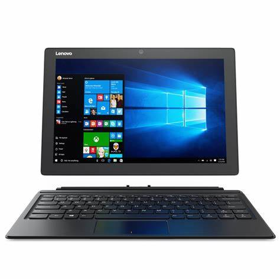

# Lenovo-Miix510_12isk-Hackintosh(STABLE)

# 参数
* 品牌型号：联想MIIX 510
* CPU：i5 6200U
* 显卡：HD520
* 内存：8G
* 声卡：ALC269
* 无线网卡：intel AC3165
* 屏幕大小：12.2寸
* 分辨率：1920x1200
* OC -Ver：0.7.9
* 版本支持：macOS Big Sur macOS Monterey

## 联想-Miix510-12isk OC引导Hackintosh
## 驱动：
* 网卡：Intel AC3165正常驱动
* 声卡：ALC269正常驱动
* 显卡：HD520正常驱动
* 触摸屏幕正常驱动
* 睿频正常
* CPU型号显示正常：双核Intel Core i5
* 蓝牙正常驱动

# 使用网上大佬的OC且自己稍微修改了下

